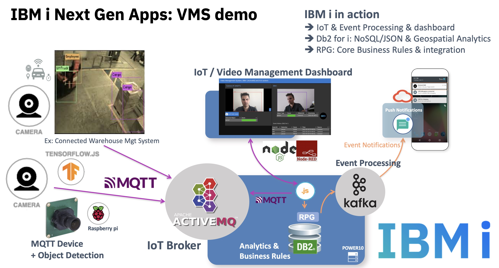

Next Gen Apps on IBM i : vms-iot-dashboard example
=================
##  Augmented WMS system with Internet of things 
This sample application includes a Node-RED dashboard that can run on a laptop (x86 Mac, Linux) integrated with an IBM i back-end. 
- IoT & Event Processing & dashboard with micro-services running on IBM i : ActiveMQ (MQTT broker), Kafka...
- Db2 for i : Nosql/JSON processing & Geospatial Analytics
- RPG : Core Business Rules & integration



### Note that there are still features to implement. Work in progress.

## Instructions - How to run the demo

- Install & start Node-red, import the project (project mode) or the flow

- Install the flow dependencies and configure the connections to IBM i : mqtt nodes,  and ODBC nodes with proper IP address (ODBC config with proper DSN in .odbc.ini file to be done on the machine running the node-red dahsboard). You'll need a Webcam on your laptop and the Tensorflow node installed

- On IBM i : Install the DB2 for i part from the DDL file provided. Use IBM ACS to run these SQL queries that will create the schema and necessary tables. Install a MQTT broker somewhere - Here , ActiveMQ on IBM i (7.4+ for geospatial analytics)
```
yum install activemq && /QOpenSys/pkgs/bin/activemq start
```
- Optional: Raspberry PI Camera: import the Rapsberry PI flow , once the integrated camera plugged and activated. Start Node-red, control that the flow can communicate with the MQTT Broker. Tested on Node.js 10 on PI (tensorflow.js constraint). If necessary , downgrade your Node.js version usign n . 
```
sudo npm install -g n 
sudo n 10.16.0
``` 

- Go to the Node-RED Dashboard page on your laptop and see the frames and AI inference results streaming to your IBM i. 


## About

Author: Benoit Marolleau benoit.marolleau@fr.ibm.com
